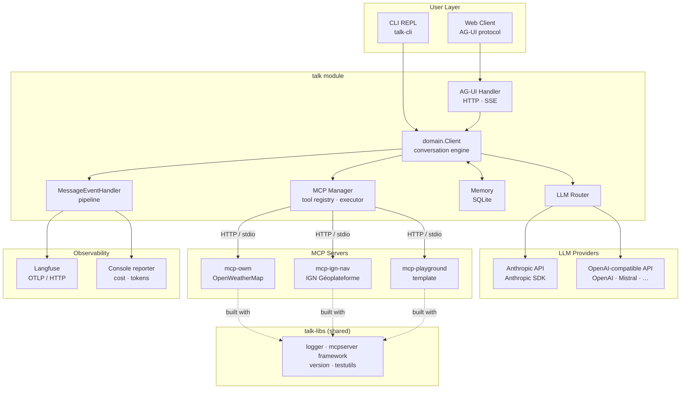

# talk-backend

[](https://github.com/pixime-net/talk-backend/actions/workflows/ci.yml)
[](https://sonarcloud.io/summary/new_code?id=pixime-net_talk-backend)
[](https://sonarcloud.io/summary/new_code?id=pixime-net_talk-backend)
[](https://go.dev)

A Go monorepo for LLM-powered applications: a multi-provider interactive CLI, an AG-UI protocol HTTP server, and standalone MCP (Model Context Protocol) tool servers.

---

## Modules

The project uses **Go workspaces** (`go.work`) with five independent modules:

| Module | Path | Description |
|--------|------|-------------|
| `talk-libs` | `./talk-libs` | Shared library: domain types, logger, MCP server framework, versioning |
| `talk` | [`./talk`](talk/README.md) | Interactive CLI + AG-UI HTTP server — multi-turn conversations with LLM providers |
| `mcp-owm` | [`./mcp-owm`](mcp-owm/README.md) | MCP server exposing [OpenWeatherMap](https://openweathermap.org/) weather data |
| `mcp-ign-nav` | [`./mcp-ign-nav`](mcp-ign-nav/README.md) | MCP server for French geographic tools (IGN Géoplateforme) |
| `mcp-playground` | [`./mcp-playground`](mcp-playground/README.md) | Minimal MCP server template for experimentation |

```
go.work (root)
├── talk-libs/        Shared: domain types, logger, mcpserver framework, version
├── talk/             CLI (REPL) + AG-UI HTTP server
├── mcp-owm/          MCP server: OpenWeatherMap weather & air quality data
├── mcp-ign-nav/      MCP server: IGN geocoding, routing, distance/time
└── mcp-playground/   MCP server: template / reference implementation
```

---

## Quickstart

### Prerequisites

- Go 1.25+
- `make`
- `golangci-lint` v2.12+ (`go install github.com/golangci/golangci-lint/v2/cmd/golangci-lint@latest`)
- At least one LLM provider API key (Anthropic, OpenAI, or Mistral)

### 1. Clone and build

```bash
git clone https://github.com/pixime-net/talk-backend.git
cd talkbackend
make build
```

### 2. Run the CLI

```bash
cd talk
cp .env.example .env
# Fill in at least one provider key
$EDITOR .env

make run
```

Switch models at runtime with `/model` or set `MODEL` on startup:

```bash
make run MODEL=sonnet-4.6
```

See [talk/README.md](talk/README.md) for all available models, CLI commands, and profiling.

### 3. Run the AG-UI server

The `talk` module includes an HTTP server implementing the [AG-UI protocol](https://github.com/nicksloan/ag-ui) for web-based LLM interactions:

```bash
cd talk
make serve
# or with hot-reload
make serve-dev
```

### 4. Run an MCP server

#### OpenWeatherMap

```bash
cd mcp-owm
cp .env.example .env
$EDITOR .env           # set OPENWEATHERMAP_API_KEY
make dev               # HTTP SSE on localhost:8080
```

#### IGN Navigation

```bash
cd mcp-ign-nav
cp .env.example .env   # public API, no key needed
make dev
```

#### Playground (template)

```bash
cd mcp-playground
make dev
```

### 5. Connect the CLI to MCP servers

Inside the CLI REPL, register a running MCP server:

```
You: /mcp add
Server name: owm
Server URL: http://localhost:8080
Auth type [none/apikey/oauth] (default: apikey): none
```

---

## Features

### Interactive CLI (`talk`)

- Multi-turn conversations with automatic tool-call resolution (up to 5 iterations per turn)
- Provider routing: **Anthropic** (`haiku-4.5`, `sonnet-4.6`), **OpenAI** (`gpt-5.4`), **Mistral** (`mistral-small`)
- MCP server discovery and management (`/mcp list`, `add`, `remove`, `refresh`)
- Session management with SQLite persistence (`/session`, `/memory`)
- Adjustable reasoning/thinking effort (`/thinking`)
- Context modes: full history, lean (summary + last turn), or hybrid (last N turns)
- Built-in pprof server for performance profiling (`--pprof`)

### AG-UI HTTP Server (`talk serve`)

- SSE-based streaming responses
- Per-request model alias resolution
- CORS configuration
- Graceful shutdown with client disconnect handling

### MCP Servers

All MCP servers share a common framework via `talk-libs/mcpserver`:

- HTTP (SSE) and stdio transport
- X-API-Key and OAuth 2.0 authentication (direct or proxy mode for Auth0 / Keycloak)
- HTTP security hardening: rate limiting, path filtering, security headers, timeouts
- Prompts support
- Docker images

### Observability

- **Langfuse** integration via OpenTelemetry OTLP HTTP — traces, token usage, latency
- **Console usage reporter** — real-time cost and token display per turn
- Both run in parallel through the `MessageEventHandler` pipeline

---

## Make targets (root)

| Target | Description |
|--------|-------------|
| `make build` | Build `talk`, `mcp-owm`, `mcp-playground` binaries |
| `make test` | Run tests for all modules |
| `make cover` | Run tests with coverage for all modules |
| `make cover-html` | Generate HTML coverage reports for all modules |
| `make vet` | Run `go vet` for all modules |
| `make lint` | Run `golangci-lint` for all modules |
| `make fmt` | Format code with `go fmt` + `goimports` |
| `make clean` | Remove build artifacts and coverage files |
| `make help` | Show available targets |

Each module has its own `Makefile` with module-specific targets.

---

## Versioning

| Context | Mechanism | Example |
|---------|-----------|---------|
| `make build` | `git describe --tags` via ldflags | `v1.2.0` or `v1.2.0-3-gdbe6a3e` |
| `make dev` / local run | `runtime/debug.ReadBuildInfo()` | `dbe6a3ee` (commit hash) |
| No VCS info | Fallback | `dev` |

---

## Additional Documentation

| File | Description |
|------|-------------|
| [`docs/langfuse.md`](docs/langfuse.md) | Langfuse OTLP observability architecture |
| [`docs/mcp-server-authentication.md`](docs/mcp-server-authentication.md) | X-API-Key and OAuth 2.0 setup (Auth0, Keycloak) |
| [`docs/mcp-server-secured.md`](docs/mcp-server-secured.md) | HTTP security hardening (rate limiting, headers, timeouts) |

---

## Development

```bash
# Run all checks
make all              # vet + test

# Lint
make lint

# Coverage
make cover

# Format code
make fmt
```

### Hot-reload

Each module supports live reloading via [Air](https://github.com/air-verse/air):

```bash
make dev
```

### Architecture diagram




