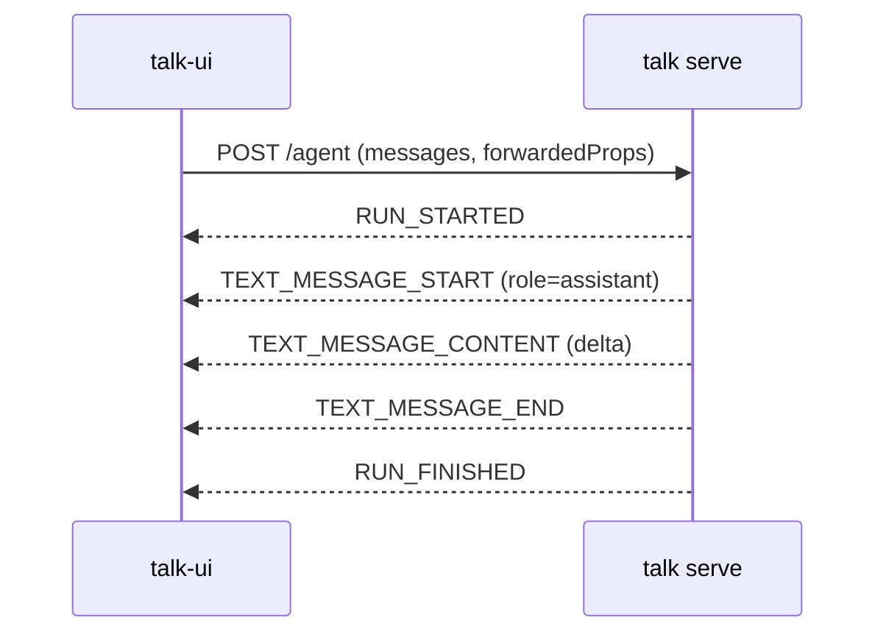
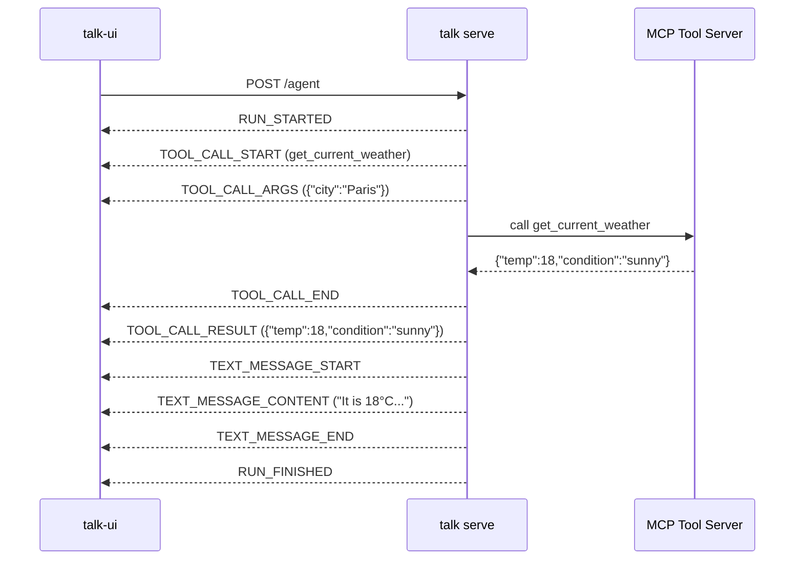
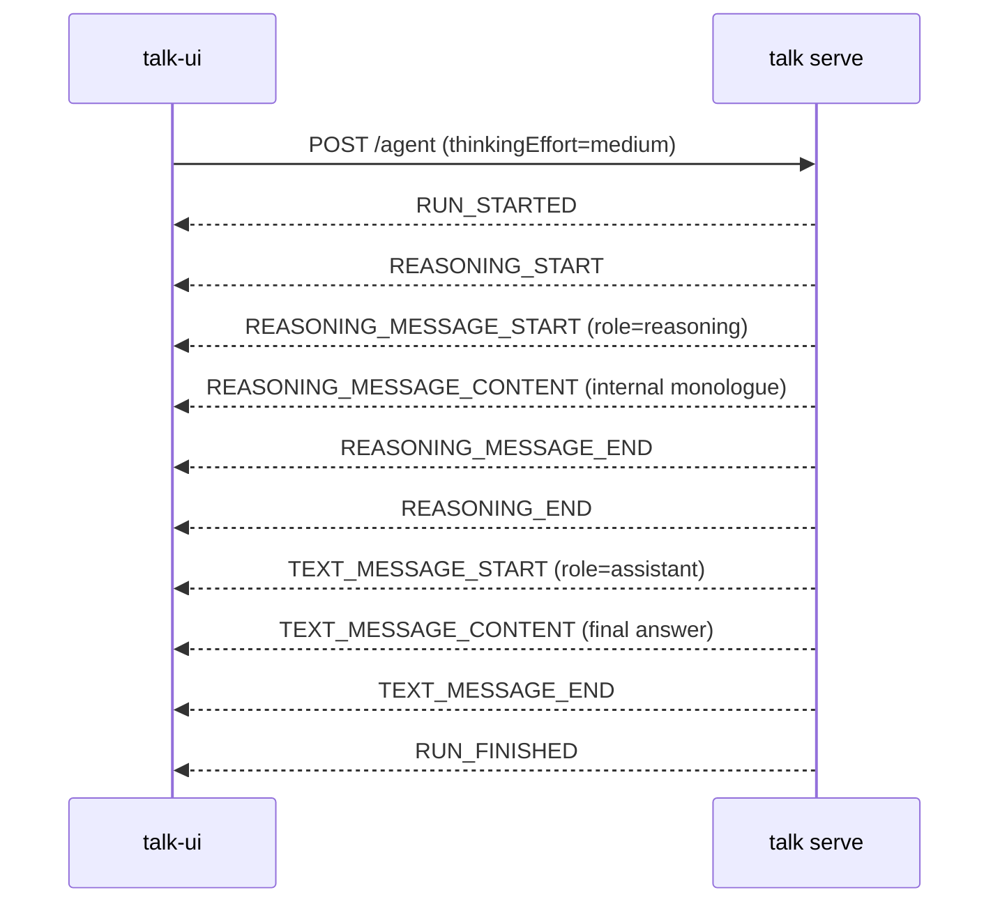
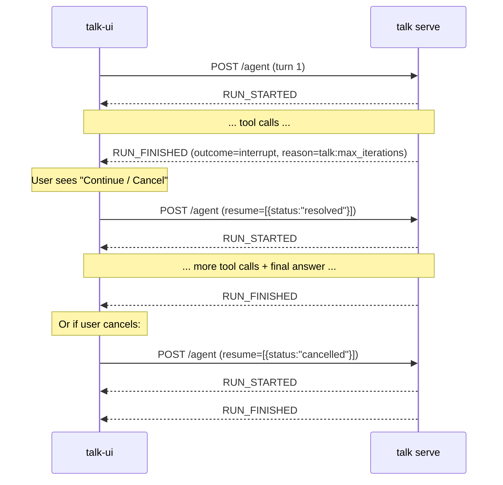

# AG-UI Protocol — Implementation Guide

This document explains how the [AG-UI protocol](https://github.com/ag-ui-protocol/ag-ui) is implemented across the `talk` stack: the HTTP server (`talk-backend/talk`) and the React frontend (`talk-ui`). It is intended to be pedagogical — it explains **why** each event exists and **what data** flows through it, not just that it does.

---

## Table of Contents

- [AG-UI Protocol — Implementation Guide](#ag-ui-protocol--implementation-guide)
  - [Table of Contents](#table-of-contents)
  - [Overview](#overview)
  - [Transport](#transport)
  - [Request: RunAgentInput](#request-runagentinput)
    - [forwardedProps — talk-specific extensions](#forwardedprops--talk-specific-extensions)
  - [Response: Server-Sent Events](#response-server-sent-events)
    - [Run lifecycle events](#run-lifecycle-events)
    - [Text message events](#text-message-events)
    - [Reasoning events (thinking models)](#reasoning-events-thinking-models)
    - [Tool call events](#tool-call-events)
    - [Error event](#error-event)
  - [Nominal flow (text response)](#nominal-flow-text-response)
  - [Tool call flow](#tool-call-flow)
  - [Thinking / reasoning flow](#thinking--reasoning-flow)
  - [Interrupt / resume flow](#interrupt--resume-flow)
  - [Frontend: how events are consumed](#frontend-how-events-are-consumed)
    - [Message normalisation](#message-normalisation)
    - [Interrupt handling](#interrupt-handling)
  - [Backend: event emission reference](#backend-event-emission-reference)

---

## Overview

AG-UI is a lightweight, streaming protocol that connects AI agents to web frontends. Its key ideas are:

- **SSE streaming**: the server sends events one at a time as they are produced. The frontend renders them incrementally — the user sees text as the model generates it, not after the full response is ready.
- **Typed events**: each event has a well-known type (`TEXT_MESSAGE_CONTENT`, `TOOL_CALL_START`, …) that tells the frontend exactly what to do with it.
- **Stateless runs**: each HTTP request is one complete conversation turn. Conversation history is carried in the request body, not stored server-side per connection.
- **Interrupt / resume**: the agent can pause mid-turn (e.g. tool iteration limit reached) and the frontend can resume or cancel the paused run.

---

## Transport

| Property        | Value                         |
| --------------- | ----------------------------- |
| Method          | `POST`                        |
| Path            | `/agent`                      |
| Request body    | `application/json`            |
| Response body   | `text/event-stream` (SSE)     |
| Default port    | `8090`                        |

Each SSE frame has the form:

```
data: {"type":"EVENT_TYPE", ...payload}\n\n
```

---

## Request: RunAgentInput

The frontend sends the full conversation history on each turn. The server is stateless with respect to the SSE connection.

```jsonc
{
  "threadId": "abc-123",          // conversation ID (stable across turns)
  "runId": "run-456",             // unique ID for this specific run
  "messages": [                   // full conversation history
    { "role": "user",      "content": "What is the weather in Paris?" },
    { "role": "assistant", "content": "It is 18°C and sunny." },
    { "role": "user",      "content": "And tomorrow?" }
  ],
  "forwardedProps": {             // talk-specific: see below
    "model": "sonnet-4.6",
    "thinkingEffort": "off"
  },
  "resume": []                    // non-empty only when resuming an interrupt
}
```

`threadId` and `runId` are generated by the frontend if not already present. The server uses them to tag all response events.

### forwardedProps — talk-specific extensions

`forwardedProps` is the AG-UI escape hatch for passing frontend values that are not part of the core protocol. The talk stack uses it for two things:

| Key              | Type                                | Description                                                  |
| ---------------- | ----------------------------------- | ------------------------------------------------------------ |
| `model`          | `string` (**required**)             | Model alias (e.g. `sonnet-4.6`, `haiku-4.5`). The backend resolves this to the correct provider and API key. |
| `thinkingEffort` | `"off" \| "low" \| "medium" \| "high"` | Reasoning depth for models that support extended thinking. Defaults to `"off"` if absent. |

---

## Response: Server-Sent Events

### Run lifecycle events

Every run starts and ends with these two events. They bracket all content events.

#### `RUN_STARTED`

Signals that the server has accepted the request and is beginning to process it. The frontend uses this to transition to the "running" state.

```json
{
  "type": "RUN_STARTED",
  "threadId": "abc-123",
  "runId": "run-456"
}
```

#### `RUN_FINISHED`

Signals that the run is complete. In the normal case it carries no extra data. In the interrupt case (see below) it carries an `outcome` with pending interrupts.

```jsonc
// Normal completion
{
  "type": "RUN_FINISHED",
  "threadId": "abc-123",
  "runId": "run-456"
}

// Interrupt (max tool iterations reached)
{
  "type": "RUN_FINISHED",
  "threadId": "abc-123",
  "runId": "run-456",
  "outcome": {
    "type": "interrupt",
    "interrupts": [
      {
        "id": "interrupt-uuid",
        "reason": "talk:max_iterations",
        "message": "I reached the tool call limit. Click Continue to let me keep working."
      }
    ]
  }
}
```

---

### Text message events

A single assistant text response is split into three sequential events. This allows the frontend to start rendering immediately on `START` and update content incrementally on each `CONTENT` event, without waiting for the full message.

> In the current implementation the backend emits the full content in a single `TEXT_MESSAGE_CONTENT` event (no token-by-token streaming). The three-event shape is preserved for protocol compatibility and future streaming support.

#### `TEXT_MESSAGE_START`

Opens a new assistant message bubble. The `messageId` links all three events together.

```json
{
  "type": "TEXT_MESSAGE_START",
  "messageId": "msg-uuid",
  "role": "assistant"
}
```

#### `TEXT_MESSAGE_CONTENT`

Carries the text content (or a chunk of it). The frontend appends it to the message identified by `messageId`.

```json
{
  "type": "TEXT_MESSAGE_CONTENT",
  "messageId": "msg-uuid",
  "delta": "It is 18°C and sunny in Paris."
}
```

#### `TEXT_MESSAGE_END`

Closes the message. The frontend renders the message as complete.

```json
{
  "type": "TEXT_MESSAGE_END",
  "messageId": "msg-uuid"
}
```

---

### Reasoning events (thinking models)

When `thinkingEffort` is not `"off"` and the model supports extended thinking (Anthropic `haiku-4.5`, `sonnet-4.6`, `opus-4.6`; OpenAI `o4-mini`), the backend emits a reasoning block **before** the final text message. This allows the frontend to display the model's internal thought process separately from the answer.

The reasoning block is wrapped in five events. The outer `REASONING_START` / `REASONING_END` pair wraps a `REASONING_MESSAGE_*` triplet that mirrors the text message structure.

#### `REASONING_START`

```json
{ "type": "REASONING_START", "messageId": "reasoning-uuid" }
```

#### `REASONING_MESSAGE_START`

```json
{
  "type": "REASONING_MESSAGE_START",
  "messageId": "reasoning-uuid",
  "role": "reasoning"
}
```

#### `REASONING_MESSAGE_CONTENT`

```json
{
  "type": "REASONING_MESSAGE_CONTENT",
  "messageId": "reasoning-uuid",
  "delta": "The user is asking about tomorrow's weather. I should call the weather tool..."
}
```

#### `REASONING_MESSAGE_END`

```json
{ "type": "REASONING_MESSAGE_END", "messageId": "reasoning-uuid" }
```

#### `REASONING_END`

```json
{ "type": "REASONING_END", "messageId": "reasoning-uuid" }
```

The frontend renders reasoning content inside a collapsible `ReasoningBlock` component, visually distinct from the assistant's final answer.

---

### Tool call events

When the model invokes an MCP tool, the backend emits four events — before and after tool execution. This lets the frontend show live tool activity (name, arguments, result) as it happens.

#### `TOOL_CALL_START`

Announces that a tool is about to be called. The `toolCallId` links the four tool-call events together.

```json
{
  "type": "TOOL_CALL_START",
  "toolCallId": "call-uuid",
  "toolCallName": "get_current_weather"
}
```

#### `TOOL_CALL_ARGS`

Carries the serialised arguments for the tool call. They are always JSON-encoded as a string.

```json
{
  "type": "TOOL_CALL_ARGS",
  "toolCallId": "call-uuid",
  "delta": "{\"city\":\"Paris\",\"units\":\"metric\"}"
}
```

#### `TOOL_CALL_END`

Signals that the tool invocation has finished.

```json
{
  "type": "TOOL_CALL_END",
  "toolCallId": "call-uuid"
}
```

#### `TOOL_CALL_RESULT`

Carries the tool output for the completed call in the SSE stream.

```json
{
  "type": "TOOL_CALL_RESULT",
  "toolCallId": "call-uuid",
  "content": "{\"temp\":18,\"condition\":\"sunny\"}"
}
```

`TOOL_CALL_RESULT.content` is treated as opaque text by the protocol. In this codebase, tools generally return JSON serialized as a string, but plain text results are also valid.

---

### Error event

Sent when an unrecoverable error occurs (missing model alias, LLM provider error, etc.). The SSE connection closes after this event.

```json
{
  "type": "RUN_ERROR",
  "message": "Unknown model \"bad-alias\". Available models: haiku-4.5, sonnet-4.6, ..."
}
```

---

## Nominal flow (text response)



---

## Tool call flow

The model may call several tools in sequence within a single run. Each tool invocation emits `TOOL_CALL_START` / `TOOL_CALL_ARGS` / `TOOL_CALL_END` / `TOOL_CALL_RESULT`. After all tool calls are complete the model produces a final text answer.



---

## Thinking / reasoning flow



---

## Interrupt / resume flow

The backend enforces a maximum number of tool call iterations per turn (to prevent infinite loops). When the limit is hit, `RUN_FINISHED` carries an interrupt instead of a normal outcome. The frontend renders a "Continue / Cancel" prompt.

On the next request the frontend populates the `resume` array with a status for each pending interrupt.



When the user cancels and has **not** typed a new message, the server emits only `RUN_STARTED` + `RUN_FINISHED` (an empty run). When the user cancels **and** types a new message, the new message is processed normally.

---

## Frontend: how events are consumed

The frontend uses the `@ag-ui/client` `HttpAgent` and `@copilotkit/react-core/v2` hooks. The AG-UI client library handles the SSE connection and assembles raw events into a `messages` array of typed objects. The talk frontend never parses SSE frames directly.

### Message normalisation

Raw AG-UI messages are not rendered directly. `normalizeMessages()` transforms them into `ChatMessageViewModel` objects that map cleanly to React components:

| AG-UI message type                       | ViewModel role  | Rendered by         |
| ---------------------------------------- | --------------- | ------------------- |
| `{ role: "user" }`                       | `"user"`        | `MessageBubble`     |
| `{ role: "assistant", content: string }` | `"assistant"`   | `MessageBubble`     |
| `{ role: "reasoning" }`                  | `"reasoning"`   | `ReasoningBlock`    |
| `{ role: "assistant", toolCalls: [...] }`| `"tool-call"`   | `ToolCallItem`      |
| `{ role: "tool" }`                       | resolved into the matching `"tool-call"` VM | `ToolCallItem` |
| cancelled notice (synthetic)             | `"notice"`      | inline text         |

Tool results (`role: "tool"`) are matched to their `toolCallId` and merged into the corresponding `tool-call` view model so that name, arguments, and result appear in a single `ToolCallItem` component.

### Interrupt handling

The `useAgent()` hook exposes `agent.pendingInterrupts`. The `ChatUIProvider` filters these to surface only interrupts with `reason === "talk:max_iterations"` as `pendingInterrupt`. The `InterruptBlock` component renders the "Continue / Cancel" prompt when `pendingInterrupt` is non-null.

On **Continue**, the frontend calls `runAgent({ resume: pendingInterrupts.map(i => ({ id: i.id, status: "resolved" })) })`.

On **Cancel**, it calls the same with `status: "cancelled"` and records the next user message ID in `cancelledNoticeIds` so a "Request cancelled by user" notice is injected before it in the message list.

---

## Backend: event emission reference

The table below maps each backend action in `talk/internal/agui/emitter.go` to the AG-UI events it emits.

| Trigger                                                   | Events emitted (in order)                                                                        |
| --------------------------------------------------------- | ------------------------------------------------------------------------------------------------ |
| Run accepted                                              | `RUN_STARTED`                                                                                    |
| Assistant message with thinking content                   | `REASONING_START` → `REASONING_MESSAGE_START` → `REASONING_MESSAGE_CONTENT` → `REASONING_MESSAGE_END` → `REASONING_END` |
| Final assistant text (no tool calls, non-empty content)   | `TEXT_MESSAGE_START` → `TEXT_MESSAGE_CONTENT` → `TEXT_MESSAGE_END`                               |
| Tool call — before execution                              | `TOOL_CALL_START` → `TOOL_CALL_ARGS`                                                             |
| Tool call — after execution                               | `TOOL_CALL_END` → `TOOL_CALL_RESULT`                                                             |
| Run completed normally                                    | `RUN_FINISHED`                                                                                   |
| Max tool iterations reached                               | `RUN_FINISHED` (outcome=interrupt, reason=`talk:max_iterations`)                                 |
| Cancelled resume with no new user message                 | `RUN_STARTED` → `RUN_FINISHED` (empty run)                                                       |
| Unrecoverable error                                       | `RUN_ERROR`                                                                                      |
