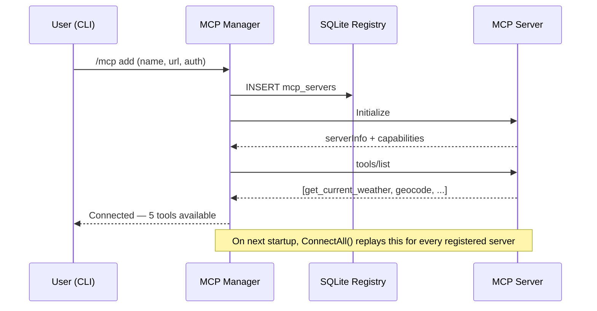
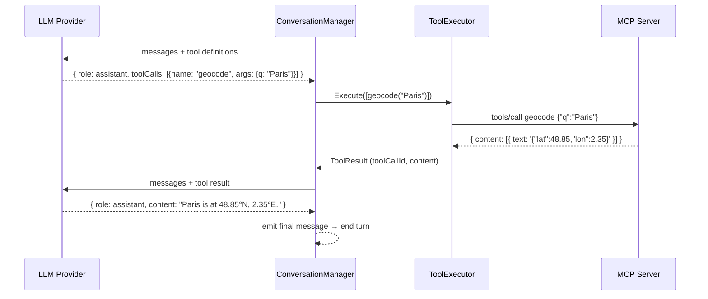

# MCP Protocol — Implementation Guide

This document explains how the [Model Context Protocol (MCP)](https://modelcontextprotocol.io/) is implemented across the `talk` stack: the shared server framework (`talk-libs/mcpserver`), the three MCP servers (`mcp-owm`, `mcp-ign-nav`, `mcp-playground`), and the MCP client embedded in the `talk` module. It is intended to be pedagogical — it explains **why** MCP exists, **what data** flows through each message, and **how** the code maps to the protocol.

---

## Table of Contents

- [MCP Protocol — Implementation Guide](#mcp-protocol--implementation-guide)
  - [Table of Contents](#table-of-contents)
  - [Overview](#overview)
  - [Protocol fundamentals](#protocol-fundamentals)
    - [JSON-RPC 2.0 messages](#json-rpc-20-messages)
    - [Transports](#transports)
  - [MCP session lifecycle](#mcp-session-lifecycle)
    - [Initialize handshake](#initialize-handshake)
    - [Tool discovery (tools/list)](#tool-discovery-toolslist)
    - [Tool execution (tools/call)](#tool-execution-toolscall)
    - [Prompts (prompts/list, prompts/get)](#prompts-promptslist-promptsget)
  - [Server side: talk-libs/mcpserver framework](#server-side-talk-libsmcpserver-framework)
    - [MCPTool — the generic interface](#mcptool--the-generic-interface)
    - [Implementing a tool (example: CurrentWeatherTool)](#implementing-a-tool-example-currentweathertool)
    - [Registering tools and starting the server](#registering-tools-and-starting-the-server)
    - [HTTP endpoints](#http-endpoints)
  - [Client side: MCP manager in talk](#client-side-mcp-manager-in-talk)
    - [Server registry (SQLite)](#server-registry-sqlite)
    - [Manager and sessions](#manager-and-sessions)
    - [Tool adapter — bridging MCP and domain](#tool-adapter--bridging-mcp-and-domain)
  - [Tool call flow in a conversation turn](#tool-call-flow-in-a-conversation-turn)
    - [Iteration limit and interrupt](#iteration-limit-and-interrupt)
    - [Concurrent tool execution](#concurrent-tool-execution)
  - [Flows](#flows)
    - [Server registration and tool discovery](#server-registration-and-tool-discovery)
    - [Tool call inside a conversation turn](#tool-call-inside-a-conversation-turn)
  - [Authentication on MCP servers](#authentication-on-mcp-servers)
  - [MCP servers in this project](#mcp-servers-in-this-project)

---

## Overview

LLMs are text-in / text-out systems. On their own they cannot query an API, read a file, or look up a weather forecast. MCP solves this by defining a standard way for a model to **discover** and **invoke** external tools at runtime, without the LLM application having to hard-code any tool logic.

The core idea is simple: a **MCP server** declares a catalogue of tools (name, description, JSON Schema for inputs and outputs). A **MCP client** (here: the `talk` conversation engine) fetches this catalogue, appends the tool definitions to the LLM prompt, and then executes any tool calls the model makes by forwarding them to the server.

The model never calls tools directly. It generates a structured message that says "call tool X with these arguments". The client executes that, returns the result, and asks the model to continue — all within a single conversation turn.

---

## Protocol fundamentals

### JSON-RPC 2.0 messages

MCP is built on [JSON-RPC 2.0](https://www.jsonrpc.org/specification). Every interaction is a JSON object with a `method` field. There are three kinds of messages:

| Kind      | Has `id` | Has `result`/`error` | Direction      |
| --------- | -------- | -------------------- | -------------- |
| Request   | yes      | no                   | client → server|
| Response  | yes      | yes                  | server → client|
| Notification | no   | no                   | either way     |

**Request example** (client asks to list tools):
```json
{
  "jsonrpc": "2.0",
  "id": 1,
  "method": "tools/list",
  "params": {}
}
```

**Response example** (server replies with one tool):
```json
{
  "jsonrpc": "2.0",
  "id": 1,
  "result": {
    "tools": [
      {
        "name": "get_current_weather",
        "description": "Returns current weather conditions for a given latitude/longitude.",
        "inputSchema": {
          "type": "object",
          "properties": {
            "lat": { "type": "number", "description": "Latitude" },
            "lon": { "type": "number", "description": "Longitude" }
          },
          "required": ["lat", "lon"]
        }
      }
    ]
  }
}
```

### Transports

MCP defines how JSON-RPC messages are carried. The servers in this project support two transports, selectable at startup via `--transport`:

| Transport       | Flag value | Endpoint | Use case                          |
| --------------- | ---------- | -------- | --------------------------------- |
| **stdio**       | `stdio`    | stdin/stdout | Claude Desktop, local tools   |
| **HTTP SSE**    | `http`     | `/sse`   | VS Code, Copilot (legacy SSE)     |
| **HTTP Streamable** | `http` | `/mcp`   | Modern clients (recommended)      |

In HTTP mode both `/sse` and `/mcp` are served simultaneously by the same process; the client picks the one it supports.

---

## MCP session lifecycle

Every connection goes through the same lifecycle regardless of transport.

### Initialize handshake

The client opens the connection and immediately sends an `initialize` request declaring its protocol version and capabilities. The server replies with its name, version, and what it supports.

```json
// Client → Server
{
  "jsonrpc": "2.0",
  "id": 0,
  "method": "initialize",
  "params": {
    "protocolVersion": "2025-03-26",
    "clientInfo": { "name": "talk", "version": "1.2.0" },
    "capabilities": {}
  }
}

// Server → Client
{
  "jsonrpc": "2.0",
  "id": 0,
  "result": {
    "protocolVersion": "2025-03-26",
    "serverInfo": { "name": "owm-mcp", "version": "1.0.0" },
    "capabilities": { "tools": {}, "prompts": {} }
  }
}
```

After this exchange the `talk` manager records the server name, version, and proceeds to list available tools.

### Tool discovery (tools/list)

The client sends `tools/list` to fetch the catalogue. The response contains one entry per tool: name, human-readable description, and a JSON Schema for the input arguments. The `talk` manager stores this list and makes it available to the conversation engine.

```json
// Client → Server
{ "jsonrpc": "2.0", "id": 1, "method": "tools/list", "params": {} }

// Server → Client
{
  "jsonrpc": "2.0",
  "id": 1,
  "result": {
    "tools": [
      {
        "name": "geocode",
        "description": "Converts a place name to latitude/longitude coordinates.",
        "inputSchema": {
          "type": "object",
          "properties": {
            "q": { "type": "string", "description": "City or address to geocode" }
          },
          "required": ["q"]
        }
      }
    ]
  }
}
```

The tool descriptions are forwarded verbatim to the LLM as part of the system context. **Good descriptions are critical**: the model uses them to decide when and how to call a tool.

### Tool execution (tools/call)

When the LLM returns a message that includes a tool call, the `talk` engine extracts the tool name and arguments, then sends a `tools/call` request to the appropriate MCP server.

```json
// Client → Server
{
  "jsonrpc": "2.0",
  "id": 2,
  "method": "tools/call",
  "params": {
    "name": "get_current_weather",
    "arguments": { "lat": 48.8566, "lon": 2.3522 }
  }
}

// Server → Client
{
  "jsonrpc": "2.0",
  "id": 2,
  "result": {
    "content": [
      {
        "type": "text",
        "text": "{\"temp\":18.2,\"condition\":\"sunny\",\"name\":\"Paris\"}"
      }
    ]
  }
}
```

The result `content` array can contain multiple items of type `text`, `image`, or `resource`. In this project all tools return a single `text` item containing a JSON-encoded structured object.

### Prompts (prompts/list, prompts/get)

MCP also defines a **prompts** capability: the server can expose pre-written prompt templates that clients can retrieve and inject into a conversation. The `mcp-owm` server, for example, exposes prompts like `current_weather` or `forecast_air` that instruct the LLM how to present weather data.

```json
// Client → Server
{ "jsonrpc": "2.0", "id": 3, "method": "prompts/list", "params": {} }

// Server → Client (excerpt)
{
  "result": {
    "prompts": [
      { "name": "current_weather", "description": "Present current weather conditions clearly." }
    ]
  }
}
```

---

## Server side: talk-libs/mcpserver framework

All three MCP servers (`mcp-owm`, `mcp-ign-nav`, `mcp-playground`) are built on the same framework in `talk-libs/mcpserver`. The framework handles transport routing, authentication, HTTP security hardening, and server lifecycle — tool authors only write business logic.

### MCPTool — the generic interface

Every tool implements a single generic interface:

```go
// MCPTool[TInput, TOutput] — defined in talk-libs/mcpserver/mcp_tool.go
type MCPTool[TInput any, TOutput any] interface {
    Name()        string
    Description() string
    Call(ctx context.Context, input TInput) (TOutput, error)
}
```

`TInput` and `TOutput` are **typed Go structs**. The framework automatically:
- generates the JSON Schema for `TInput` from struct tags and field types (used in `tools/list`)
- deserialises the JSON arguments from `tools/call` into a `TInput` value
- serialises the `TOutput` value into the JSON text content of the response

Tool authors never touch JSON manually. Type safety is enforced at compile time.

### Implementing a tool (example: CurrentWeatherTool)

```go
// Input — field names become JSON argument names, description tags become schema descriptions
type CurrentWeatherToolInput struct {
    Lat float64 `json:"lat" description:"Latitude of the location"`
    Lon float64 `json:"lon" description:"Longitude of the location"`
}

// Output — returned as serialised JSON in the tool result content
type CurrentWeatherToolOutput struct {
    Temp      float64 `json:"temp"       description:"Current temperature in Celsius"`
    FeelsLike float64 `json:"feels_like" description:"Perceived temperature in Celsius"`
    Name      string  `json:"name"       description:"City name"`
    // ... more fields
}

type CurrentWeatherTool struct { client *httpClient }

func (t *CurrentWeatherTool) Name()        string { return "get_current_weather" }
func (t *CurrentWeatherTool) Description() string { return "Returns current weather..." }

func (t *CurrentWeatherTool) Call(ctx context.Context, input CurrentWeatherToolInput) (CurrentWeatherToolOutput, error) {
    // call OpenWeatherMap API, return typed result
}
```

### Registering tools and starting the server

```go
app := mcpserver.NewApp("owm-mcp", version.Version,
    mcpserver.WithAPIKey(env.APIKey),
    mcpserver.WithOAuth(oauthCfg),
    mcpserver.WithTools(mcpserver.RegisterTool(weatherTool)),
    mcpserver.WithTools(mcpserver.RegisterTool(geocodingTool)),
    mcpserver.WithPrompts(mcpserver.RegisterPrompt(prompts.CurrentWeather)),
    mcpserver.WithBaseEnvHTTPSecurity(env.BaseEnv),
)
app.Run() // parses the --transport flag, then starts
```

`app.Run()` reads `--transport` from the command line:
- `stdio`: reads JSON-RPC from stdin, writes to stdout (used by Claude Desktop)
- `http`: starts an HTTP server on `$HTTP_HOST:$HTTP_PORT` (default `localhost:8080`) with
  `/sse` and `/mcp` endpoints

### HTTP endpoints

| Path    | Transport            | Typical client            |
| ------- | -------------------- | ------------------------- |
| `/sse`  | HTTP + SSE           | VS Code, legacy Copilot   |
| `/mcp`  | HTTP Streamable      | Modern AG-UI clients      |

Both endpoints go through the same authentication and security middleware stack (see [mcp-server-secured.md](mcp-server-secured.md) and [mcp-server-authentication.md](mcp-server-authentication.md)).

---

## Client side: MCP manager in talk

The `talk` module contains a fully-featured MCP client implemented in `talk/internal/mcp/`.

### Server registry (SQLite)

MCP server configurations are persisted in a SQLite table (`mcp_servers`) shared with the conversation store. This means registrations survive across CLI sessions and are automatically reconnected on startup.

```sql
CREATE TABLE mcp_servers (
    id        TEXT PRIMARY KEY,
    name      TEXT NOT NULL UNIQUE,
    url       TEXT NOT NULL,
    auth_type TEXT NOT NULL DEFAULT 'apikey',  -- none | apikey | oauth
    api_key   TEXT NOT NULL DEFAULT '',
    oauth     TEXT NOT NULL DEFAULT ''         -- JSON-encoded OAuthConfig
);
```

From the CLI REPL, servers are managed with `/mcp add | list | remove | refresh`.

### Manager and sessions

`mcp.Manager` maintains an in-memory map of active `mcp.ClientSession` objects, one per registered server. On startup (`ConnectAll`), it iterates all registered configs, opens a session for each, and calls `tools/list` to populate the tool catalogue.

If a session is lost (network error, server restart), the Manager reconnects lazily: the next time a tool on that server is invoked, `EnsureConnected` detects the nil session and triggers a reconnect via `singleflight` (preventing duplicate concurrent reconnection attempts).

```
startup
  └─ ConnectAll()
       ├─ connectServer(owm)    → Initialize → tools/list → store session + tools
       ├─ connectServer(ign)    → Initialize → tools/list → store session + tools
       └─ ...

tool call
  └─ EnsureConnected(serverID)
       ├─ session exists?  → return it
       └─ session nil?     → reconnect() via singleflight
```

### Tool adapter — bridging MCP and domain

The conversation engine works with `domain.Tool` (a generic interface). Each remote MCP tool is wrapped in a `mcpToolAdapter` that:
1. Exposes `Name()`, `Description()`, and `InputSchema()` from the `mcp.Tool` struct (returned by `tools/list`)
2. Implements `Execute()` by calling `tools/call` on the corresponding `mcp.ClientSession`

This means the conversation engine is completely unaware of MCP — it sees a flat list of tools regardless of how many servers they come from.

---

## Tool call flow in a conversation turn

The conversation engine (`domain.ConversationManager`) runs a **tool call loop** inside each turn:

```
1. Send current messages to LLM
2. LLM response has tool calls?
   YES → execute tools → append results to messages → go to 1
   NO  → emit final assistant message → end turn
```

### Iteration limit and interrupt

To prevent infinite loops (e.g. a tool call that always returns an error the model keeps retrying), the loop has a hard limit: **2 tool-call rounds per turn** (`maxToolCalls = 2` in `domain/conversation.go`).

When the limit is reached, the `talk` server emits a `RUN_FINISHED` with an interrupt outcome (`reason: "talk:max_iterations"`) and the frontend displays a "Continue / Cancel" prompt (see [ag-ui-protocol.md](ag-ui-protocol.md)).

### Concurrent tool execution

When the LLM returns multiple tool calls in a single message (e.g. "get weather AND route simultaneously"), the `ToolExecutor` can run them in parallel:

| `TOOLS_MAX_CONCURRENT` | Behaviour                                    |
| ---------------------- | -------------------------------------------- |
| `1`                    | Sequential — tools run one after the other   |
| `N > 1` (default: `4`) | Up to N tools execute concurrently via goroutines |

The constraint is that **all** tool results must be available before the next LLM call, so parallelism reduces latency when tool calls are independent of each other.

---

## Flows

### Server registration and tool discovery



### Tool call inside a conversation turn



---

## Authentication on MCP servers

MCP servers in this project support two authentication mechanisms, which can be combined:

| Mechanism          | Header                      | When to use                              |
| ------------------ | --------------------------- | ---------------------------------------- |
| **API Key**        | `X-API-Key: <secret>`       | Local development, VS Code, Copilot      |
| **OAuth 2.0 JWT**  | `Authorization: Bearer JWT` | Remote clients (Claude.ai, web frontends)|

The `talk` MCP Manager uses API Key or OAuth credentials stored in the SQLite registry when opening sessions. See [mcp-server-authentication.md](mcp-server-authentication.md) for the full setup guide.

---

## MCP servers in this project

| Server            | Path            | Tools                                                                                          | External API              |
| ----------------- | --------------- | ---------------------------------------------------------------------------------------------- | ------------------------- |
| `mcp-owm`         | `mcp-owm/`      | `get_current_weather`, `geocode`, `reverse_geocode`, `get_current_air_pollution`, `get_forecast` | OpenWeatherMap            |
| `mcp-ign-nav`     | `mcp-ign-nav/`  | `geocode`, `reverse_geocode`, `route`, `distance_time`                                         | IGN Géoplateforme (France)|
| `mcp-playground`  | `mcp-playground/` | minimal example tools                                                                        | none (template)           |

All three are built with `talk-libs/mcpserver`, so they inherit identical transport, authentication, security hardening, and observability behaviour. Only the `main.go` and `internal/tools/` directories differ between them.
